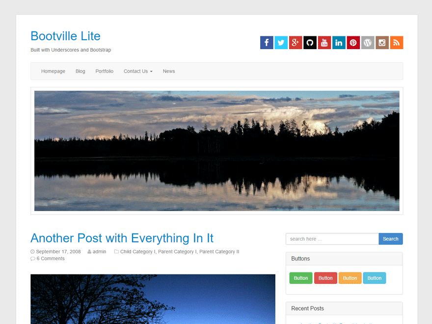

# Bootville Lite #

Bootville lite is a clean responsive WordPress theme created with Underscores starter theme by Automattic and Bootstrap framework and Font Awesome.

## Features ##
- Clean responsive layout, works on any screen size
- Two menu areas, one in the header and one in the footer
- 4 Widget areas, one in the right sidebar, three in the footer
- Display featured image above each post
- Social network icons by Font Awesome in the header via custom menu
- All Boostrap components available via several shortcode plugins or HTML
- Header area will display the free CPT Bootstrap Carousel plugin without adding any code, or header image or no image
- Easily add Bootswatch color schemes or create child themes
- Portfolio page template upgrade available
- Full theme version available with many useful options including page templates, 200+ Google Fonts, homepage template and sidebar layouts
- GPL 2 licensed

Visit http://zeaks.org for questions on modifying and other Bootville resources.

